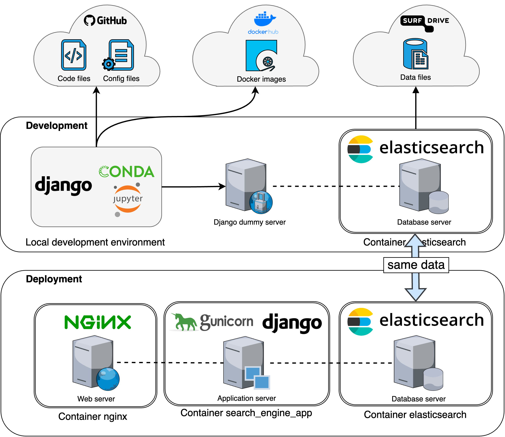
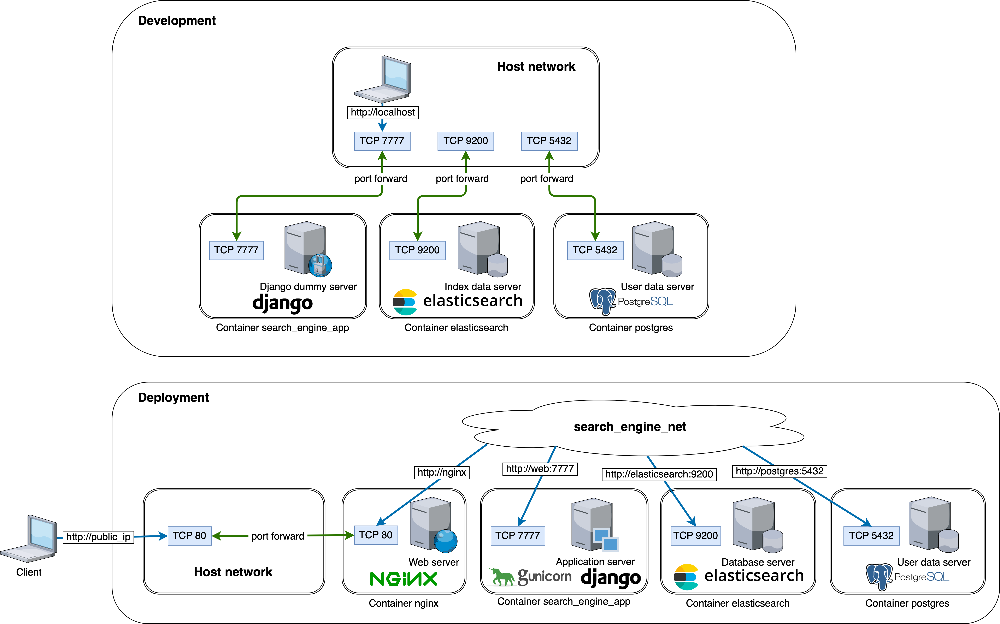
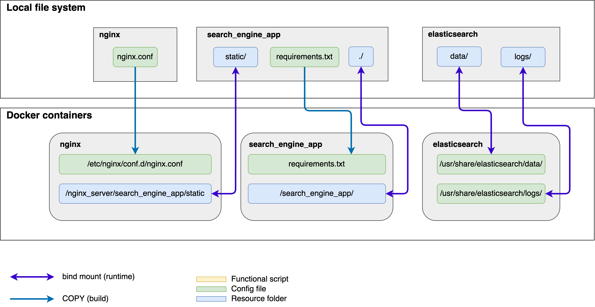

# Notebook search engine backend
A search engine for various types of research assets. 
Right now it is focused on notebook search. 

------------------------------------------------------------------------------------------------------

## Deployment / Production
The deployment lives on docker and is accesible from the Internet. 

### Prerequisites 
- Open port 80/tcp
- Docker

### Usage
1. Setup environment on host machine, refer to `os_env_setup.sh`
2. Clone the repository
```
git clone https://github.com/nali001/notebook_search_docker.git
```
3. Setup Elasticsearch data folder. Navigate to `notebook_search_docker` and run the following: 
```
mkdir elasticsearch/data elasticsearch/logs 
chmod g+rwx elasticsearch/data elasticsearch/logs 
sudo chgrp 0 elasticsearch/data elasticsearch/logs
```
4. Setup PostgresSQL data folder. Navigate to `notebook_search_docker` and run the following: 
```
mkdir postgres/data postgres/logs postgres/pgadmin
chmod g+rwx postgres/data postgres/logs postgres/pgadmin
sudo chgrp 0 postgres/data postgres/logs postgres/pgadmin
```
5. Inside `search_engine_app/manage.py`, replace with the following line: 
```
os.environ.setdefault('DJANGO_SETTINGS_MODULE', 'search_engine_app.settings')

```
6. Inside `search_engine_app/search_engine_app/setting.py`, replace the following line with your actual IP address: 
```
ALLOWED_HOSTS = ['127.0.0.1', 'localhost', 'IP_address']
```
7. Prepare the data. Put your notebooks under `notebooksearch/Kaggle Notebook`

8. Run 
```
docker compose up
```
If the system does not work properly, either wait for some time for all containers to go up, or run `docker compose build` to update the images. 

Now you can access the web page on http://IP_address/

9. Initialize the web application via: http://IP_address/api/initialize_app/

10. Obtain API token via: http://IP_address/api/obtain_api_token/


### Administration
We expose `pgadmin` service to the localhost so that you can easily monitor the database. Access it through http://localhost:5050/ 

We expose `Django admin` service to public web. Access it through http://IP_address/admin/ 


However, `postgres` `search_engine_app` and `Elasticsearch` services are only accessible within the docker network and thus cannot be accessed from the host machine or the web. 

Postgres pgadmin login 
```
Username: postgres@notebooksearch.com
Password: notebooksearch2022
```

Postgres pgadmin server connection
```
Hostname: postgres
Username: postgres
Password: notebooksearch2022
```

------------------------------------------------------------------------------------------------------


## Development
Development is mainly for Django project.  

### Prerequisites 
- Conda
- Python 3.8
- Django 4.0
- Elsticsearch server


### Environment setup
1. Setup environment on host machine, refer to `os_env_setup.sh`
2. Clone the repository
```
git clone https://github.com/nali001/notebook_search_docker.git
```
3. Setup local Python environment, refer to `search_engine_app/dev_env_setup.sh`
4. Start `Elasticsearch` service in docker. It can be accessed via `localhost:9200`
```
docker compose -f docker-compose_es.yml up
```

5. Start `Postgres` service in docker. It can be accessed via `localhost:5432`
```
docker compose -f docker-compose_postgres_admin.yml up
```
If you don't want to use pgadmin4, run the following: 
```
docker compose -f docker-compose_postgres.yml up
```

6. Prepare the data. Put your notebooks under `notebook_search/Kaggle Notebook`. Then go to 
`search_engine_app` and run 
```
python -m notebooksearch.notebook_indexing
```
Now you are good to go! and run 
```
conda activate notebook_search
python manage.py runserver 7777
```

### Open ports
+ Django dummy server (search_engine_app): 7777
+ Elasticsearch: 9200
+ Postgres: 5432
+ pgadmin: 5050


### Postgres inspection
Get into postgres docker container: 
```
sudo docker exec -it notebook_search_docker-postgres-1 /bin/bash
```
Connect to the DMBS using `psql`: 
```
psql -U postgres
```

### Django administration
Create superuser for admin: 
```
python manage.py createsuperuser
python manage.py createsuperuser --username admin  --email admin@notebooksearch.com
# password: notebooksearch2022
```

Create superuser for aubergine and generate tokens: 
```
python manage.py createsuperuser --username aubergine  --email aubergine@notebooksearch.com
# password: notebooksearch2022

python manage.py drf_create_token aubergine
```
Update data models to database (PostgreSQL in our case)
```
python manage.py makemigrations
python manage.py migrate
```

------------------------------------------------------------------------------------------------------


## REST API
API endpoint: http://IP_address/api/

API examples are in the file `apis/api_test.py`

### Authentication 
We are using TokenAuthentication. Ref: https://www.django-rest-framework.org/api-guide/authentication/#generating-tokens 

Obtain a API token: 
```
GET http://IP_address/api/obtain_api_token/ 
```


### APIs
Test API token: 
```
GET http://IP_address/api/ 
```
Creat user profile: 
```
POST http://IP_address/api/create_userprofile/ 
```

Notebook search: 
```
GET/POST http://IP_address/api/notebook_search/
```

------------------------------------------------------------------------------------------------------

## Data backup and restore
It is important to persist your data, especially when you run everything inside containers. 

### Elasticsearch data backup
Please refer to `es_backup.sh`.

------------------------------------------------------------------------------------------------------
## Framework Design Philosophy 

### High-level structure 


### Network connection 


### Storage 



------------------------------------------------------------------------------------------------------
## Folder explanation
### nginx

### elasticsearch 

### search_engine_app

### search_engine_app/notebook_search
The Django project, providing URL resolvement, data processing and web page generation

+ `notebook_indexing.py`: Feed preprocessed notebook files under `Jupyter Notebook` to Elasticsearch database


### docker-compose.yml 
Docker compose file for setting up **deployment** environment. 

### docker-compose.dev.yml 
Docker compose file for setting up **development** environment. 


-------------------------------------------------------------------------------------------------------
## Python-related tips
### Run scripts separately
Each djano app is considered as a package, we assume all the Python scripts are executed from `search_engine_app` dir. 

For example, if you wanna invoke `notebook_indexing` from CLI, use
```
python -m notebook_search.notebook_indexing.py
```

### Imports
+ Only use import for packages and modules, not classes or functions. 
+ Always use absolute path for importing modules even it is from the same package. 

In this case, you would not be confused by changing `sys.path`