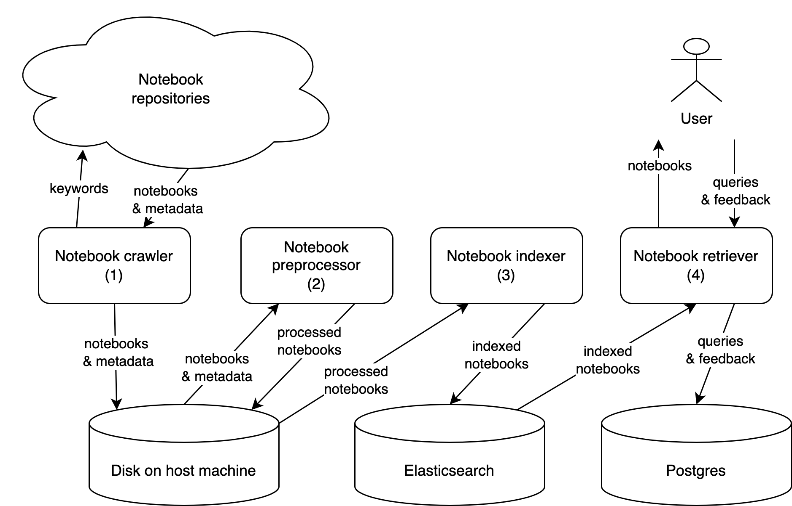

# Notebook search engine backend
A search engine for various types of research assets. 
Right now it is focused on notebook search. 

------------------------------------------------------------------------------------------------------

## Deployment / Production 
### Prerequisites 
- Open port 80/tcp
- Docker

### Usage
1. Clone the repository under branch `deploy`
```
git clone --branch deploy git@github.com:nali001/notebook_search_docker.git
```
2. Setup environment on host machine, refer to `deploy_host_setup.sh`

3. Setup data folders. Navigate to `notebook_search_docker` and run the following: 
```
sudo chmod -R g+rwx elasticsearch/data elasticsearch/logs 
sudo chmod -R g+rwx postgres/data postgres/logs pgadmin/data
sudo chmod -R g+rwx search_engine_app/notebooksearch/Notebooks/
sudo chgrp -R 0 elasticsearch/data elasticsearch/logs
sudo chgrp -R 0 postgres/data postgres/logs pgadmin/data
sudo chgrp -R 0 search_engine_app/notebooksearch/Notebooks
```

This step is crucial for accesses and persistent storage of data. 

4. Prepare the notebooks for indexing. \
Put the preprocessed notebooks `Kaggle_preprocessed_notebooks.csv` and the raw notebooks `Kaggle_raw_notebooks.csv` under the folder `search_engine_app/notebooksearch/Notebooks` 


5. Run 
```
docker compose up
```
If the system does not work properly, either wait for some time for all containers to go up, or run `docker compose build` to update the images. 

Now you can access the web page on `http://IP_address/`

6. Initialize the web application via: `http://IP_address/api/initialize_app/`


### Administration
We expose `pgadmin` service to the localhost so that you can easily monitor the database. Access it through `http://localhost:5050/`

We expose `Django admin` service to public web. Access it through `http://IP_address/admin/` 

We expose `Elasticsearch` service to localhost so that you can update Elasticsearch server from the host machine, without modifying code within Django project. Access it through `http://localhost/9200/` 


However, services `postgres`, `search_engine_app`, `Elasticsearch` are only accessible within the docker network and thus cannot be accessed from the host machine or the web. 

Postgres pgadmin login 
```
Username: postgres@notebooksearch.com
Password: notebooksearch2022
```

Postgres pgadmin server connection
```
Hostname: postgres
Username: postgres
Password: notebooksearch2022
```

------------------------------------------------------------------------------------------------------


## Development
Development is mainly for Django project.  

### Prerequisites 
- Conda
- Python 3.8
- Django 4.0
- Elsticsearch server


### Environment setup
1. Clone the whole repository
```
git clone git@github.com:nali001/notebook_search_docker.git
```

2. Setup environment on host machine, refer to `dev_host_setup.sh`

3. Setup data folders. Navigate to `notebook_search_docker` and run the following: 
```
sudo chmod -R g+rwx elasticsearch/data elasticsearch/logs 
sudo chmod -R g+rwx postgres/data postgres/logs pgadmin/data
sudo chgrp -R 0 elasticsearch/data elasticsearch/logs
sudo chgrp -R 0 postgres/data postgres/logs pgadmin/data
```

4. Start services `Postgres`, `pgadmin` and `Elasticsearch` in docker. 
```
docker compose -f docker-compose_dev.yml up
```

Or you can start them separately using: 
```
docker compose -f docker-compose_es.yml up
docker compose -f docker-compose_postgres_admin.yml up
```

If you don't want to use pgadmin4, run the following: 
```
docker compose -f docker-compose_postgres.yml up
```

6. Prepare the notebooks for indexing. \
Put the preprocessed notebooks `Kaggle_preprocessed_notebooks.csv` and the raw notebooks `Kaggle_raw_notebooks.csv` under the folder `search_engine_app/notebooksearch/Notebooks` \
Then go to 
`search_engine_app` and run 
```
python -m notebooksearch.notebook_indexing
```
Now you are good to go! Run the following to start your search engine:  
```
conda activate notebooksearch
python manage.py runserver 7777
```

### Accessing addresses
+ Django dummy server (search_engine_app): `localhost:7777`
+ Elasticsearch: `localhost:9200`
+ Postgres: `localhost:5432`
+ pgadmin: `localhost:5050`


### Postgres inspection
Get into postgres docker container: 
```
sudo docker exec -it notebook_search_docker-postgres-1 /bin/bash
```
Connect to the DMBS using `psql`: 
```
psql -U postgres
```

### Django administration
Create superuser for admin: 
```
python manage.py createsuperuser
python manage.py createsuperuser --username admin  --email admin@notebooksearch.com
# password: notebooksearch2022
```

Create superuser for aubergine and generate tokens: 
```
python manage.py createsuperuser --username aubergine  --email aubergine@notebooksearch.com
# password: notebooksearch2022

python manage.py drf_create_token aubergine
```
Update data models to database (PostgreSQL in our case)
```
python manage.py makemigrations
python manage.py migrate
```

------------------------------------------------------------------------------------------------------

## REST API
API endpoint: 
```
http://IP_address/api/
```

API examples are in the file `apis/api_test.py`

### Authentication 
We are using TokenAuthentication. Ref: https://www.django-rest-framework.org/api-guide/authentication/#generating-tokens 

Obtain a API token: 
```
GET http://IP_address/api/obtain_api_token/ 
```


### APIs
Test API token: 
```
GET http://IP_address/api/ 
```
Creat user profile: 
```
POST http://IP_address/api/create_userprofile/ 
```

Notebook search: 
```
GET/POST http://IP_address/api/notebook_search/
```


### Add a new API to `notebooksearch` app
- Modify `docs/system_design.md`
- Add `apis/new_api.py`
- Modify `apis/urls.py`
- Add `notebooksearch/new_api_functions.py`
- Modify `notebooksearch/models.py`
- Modify `notebooksearch/serializers.py`
- Modify `apis/api_test.py`

------------------------------------------------------------------------------------------------------

## Data backup and restore
It is important to persist your data, especially when you run everything inside containers. 

### Elasticsearch data backup
Please refer to `es_backup.sh`.

------------------------------------------------------------------------------------------------------
## Framework Design Philosophy 

### Functional modules


### High-level structure 


### Network connection 


### Storage 


------------------------------------------------------------------------------------------------------
## Folder explanation
### - nginx/
For docker build `nginx` service. 

### - elasticsearch/ 
For docker build `elasticsearch` service and mounting data between docker contains and host machine. 

### - search_engine_app/
For docker build `search_engine_app` service and mounting data between docker contains and host machine. 

### - postgres/
For docker build `postgres` service and mounting data between docker contains and host machine. 

### - search_engine_app/
The Django project. 

#### -- notebook_search/
Django app for implementing notebook search functionalities. 
+ `notebook_indexing.py`: Feed preprocessed notebook files under `Jupyter Notebook` to Elasticsearch database

#### -- apis/
Django app for implementing REST APIs. 

#### -- dev_env_setup.sh
Bash script for setting up Django project running env on the local machine. \
For **Development** only. 

#### -- django_app_setup.sh
Bash script for setting up Django project inside the container of `search_engine_app` service, used by Dockerfile. \
For **Deployment** only. 

#### -- requirements.txt
Python library dependencies. 

#### -- requirements_dev.txt
Python library dependencies. 


### - docker-compose.yml 
Docker compose file for setting up **deployment** environment, including all the services. 

### - docker-compose_es.yml 
Docker compose file for setting up `elasticsearch` service inside a container. 

### - docker-compose_postgres.yml 
Docker compose file for setting up `postgres` service inside a container. 

### - docker-compose_postgres_admin.yml 
Docker compose file for setting up `postgres` and `pgadmin` services inside containers. 

### - os_backup.sh
Bash script for creating backups for elasticsearch data. 


-------------------------------------------------------------------------------------------------------
## Python-related tips
### Run scripts separately
Each djano app is considered as a package, we assume all the Python scripts are executed from `search_engine_app` dir. 

For example, if you want to invoke `notebook_indexing` from CLI, use
```
python -m notebook_search.notebook_indexing.py
```

### Imports
+ Only use import for packages and modules, not classes or functions. 
+ Always use absolute path for importing modules even it is from the same package. 

In this case, you would not be confused by changing `sys.path`


-------------------------------------------------------------------------------------------------------
## Debug
### Host machine IP address
The bash script `host_env_setup.sh` together with `django_app_setup.sh` will automatically detect and pass the public IP address of host machine to `search_engine_app` service. 

If it is not working, then inside `search_engine_app/search_engine_app/setting_prod.py`, replace the following line with your actual IP address: 
```
ALLOWED_HOSTS = ['127.0.0.1', 'localhost', 'IP_address']
```
You can find the IP address with command: 
```
hostname -I
```
