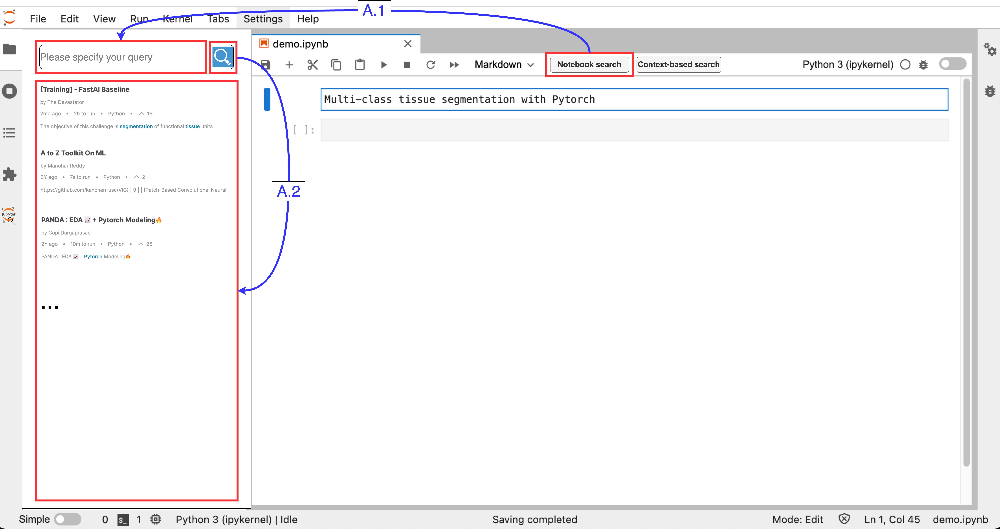
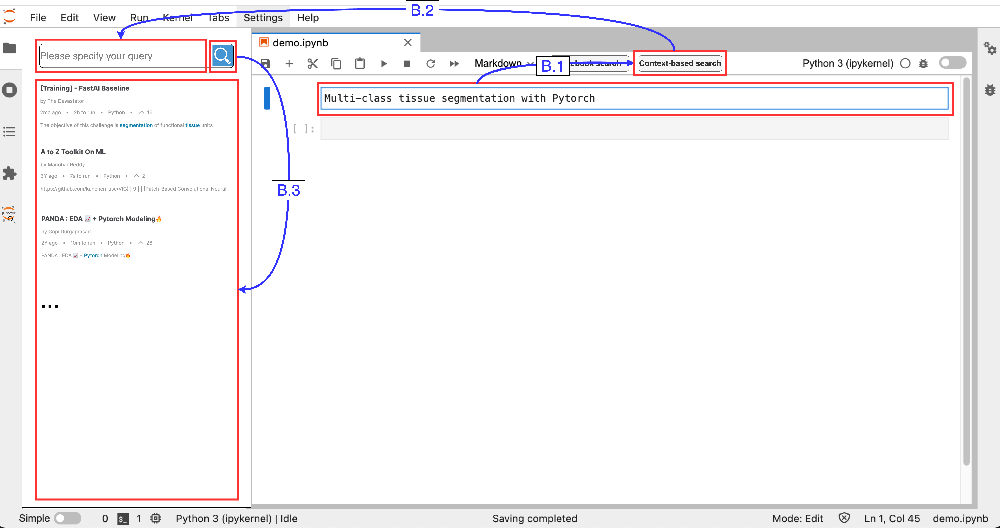
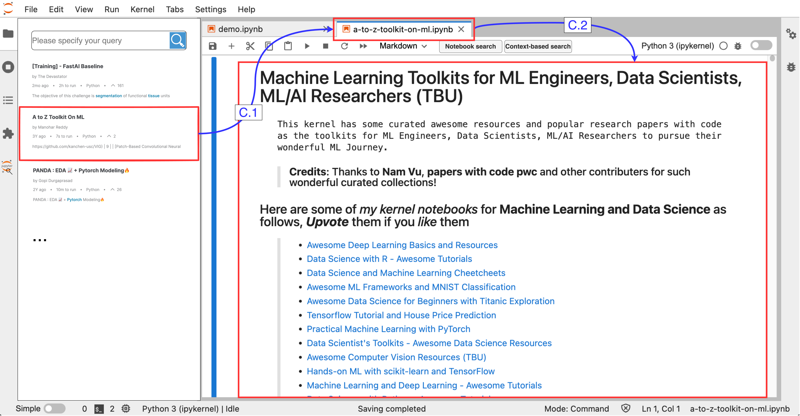
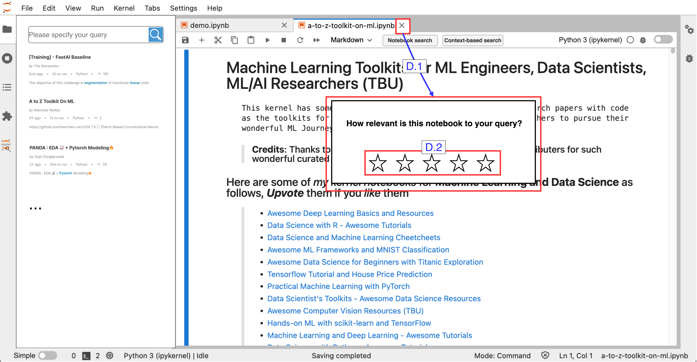
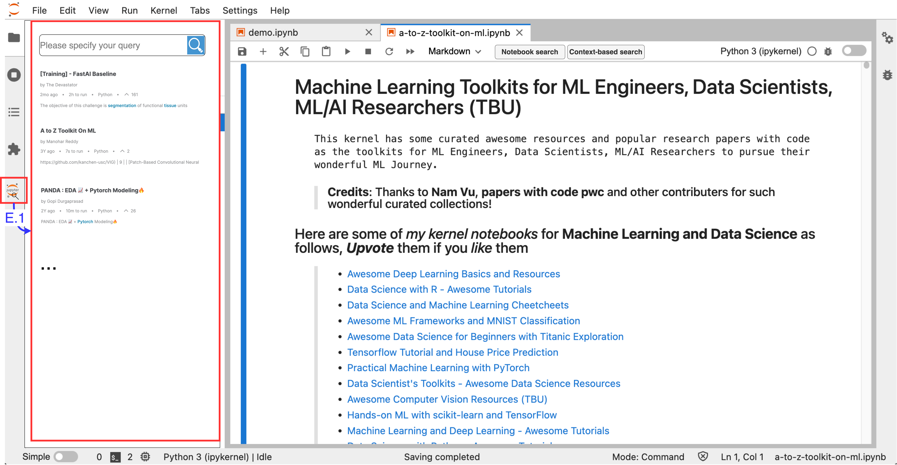

# System Design
## Frontend UI
### A. Notebook search


### B. Context-based search


### C. Result inspection


### D. Relevancy feedback


### E. Review history



-----------------------------------------------------------------------------------------------
## Data exchange between frontend and backend
### Main data models
`<ClientUser>` 
```
{
    "client_id": client_id, 
}
```

`<KaggleNotebook object>` 
```
{
    "name": name, 
    "source": source, 
    "html_url": html_url, 
    "description": description, 
    "docid": docid, 
    "kaggle_id": kaggle_id,
    "file_name": file_name, 
}
```

`<CellContent object>` 
```
{
    "cell_type": cell_type,
    "cell_content": cell_content,  
}
```

`<GeneratedQuery object>` 
```
{
    "method": generation_method, 
    "queries": [query_text], 
}
```

`<AnnotatedNotebook object>` 
```
{
    "name": name, 
    "source": source, 
    "html_url": html_url, 
    "description": description,
    "unified_notebook_id": unified_notebook_id, 
}
```


### A.1-A.2 [Notebook search session]
When clicking the search icon: 

client --> server \
`NotebookSearchLogSerializer`
```
{
    "client_id": client_id, 
    "timestamp": timestamp, 
    "event": "notebook_search", 
    "query": query,
}
```

server --> client \
`NotebookSearchResultSerializer`
```
{
    "query" = query
    "facets" = facets
    "num_hits" = num_hits
    "num_pages" = num_pages
    "current_page" = current_page
    "results": [<KaggleNotebook object>], 
}
```
server --> database \
`NotebookSearchLogSerializer`
```
{
    "client_id": client_id, 
    "timestamp": timestamp, 
    "event": "notebook_search", 
    "query": query,
}
```


### B.1 [Query generation session]
When clicking the "Context-based search" button: 

client --> server \
`QueryGenerationLogSerializer`
```
{
    "client_id": client_id, 
    "timestamp": timestamp, 
    "event": "query_generation", 
    "cell_contents": [<CellContent object>]
}
```

server --> client \
`QueryGenerationResultSerializer`
```
{
    "client_id": client_id, 
    "timestamp": timestamp, 
    "event": "query_generation", 
    "cell_contents": [<CellContent object>], 
    "generated_queries": [<GeneratedQuery object>], 
}
```

server --> database \
`QueryGenerationLogSerializer`
```
{
    "client_id": client_id, 
    "timestamp": timestamp, 
    "event": "query_generation", 
    "cell_contents": [<CellContent object>]
}
```

### B.2-B.3 [Context-based search session]
When clicking the search icon:

client --> server \
`ContextSearchLogSerializer`
```
{
    "client_id": client_id, 
    "timestamp": timestamp, 
    "event": "context_search", 
    "query": query, 
    "cell_contents": [<CellContent object>]
    "generated_queries": [<GeneratedQuery object>], 
}
```

server --> client \
`KaggleContextSearchResultSerializer`
```
{
    "client_id": client_id, 
    "timestamp": timestamp, 
    "event": "context_search", 
    "query": query, 
    "cell_contents": [<CellContent object>], 
    "generated_queries": [<GeneratedQuery object>], 
    "search_results": [<NotebookSearchResult object>], 
}
```

server --> client \
`ContextSearchLogSerializer`
```
{
    "client_id": client_id, 
    "timestamp": timestamp, 
    "event": "context_search", 
    "cell_contents": [<CellContent object>]
    "generation_results": [<GeneratedQuery object>], 
    "query": query
}
```


### D.1-D.2 [relevancy annotation]
When clicking the stars: \
client --> server \
`RelevancyFeedbackLogSerializer`
```
{
    "client_id": client_id, 
    "timestamp": timestamp, 
    "event": "relevancy_feedback", 
    "query": query, 
    "num_stars": num_stars, 
    "annotated_notebook": <AnnotatedNotebook object>, 
}
```

server --> client \
`RelevancyFeedbackResponse`
```
{
    "user": <user object>, 
    "event": "relevancy_feedback", 
    "query": query, 
    "notebook": <notebook_result object>, 
    "num_stars": num_stars, 
    "success": True, 
}
```
If success is not True, then the client should send the data again. 

server --> database \
`RelevancyFeedbackLog`
```
{
    "user": <user object>, 
    "event": "relevancy_feedback", 
    "query": query, 
    "notebook": <notebook_result object>, 
    "num_stars": num_stars, 
}
```